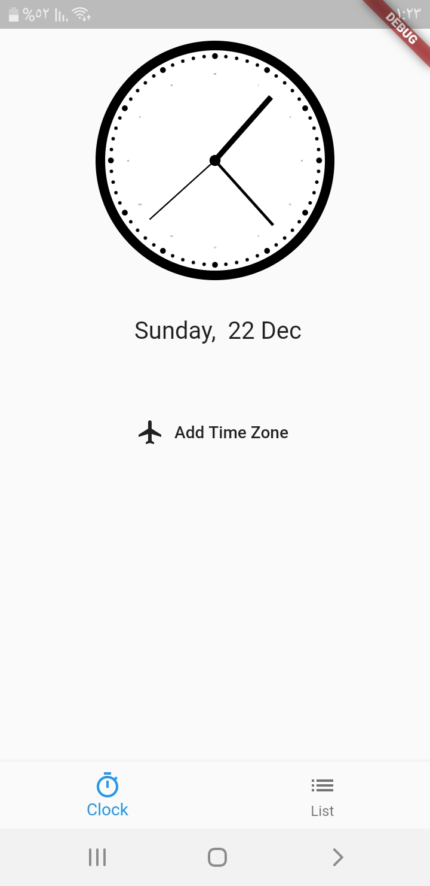
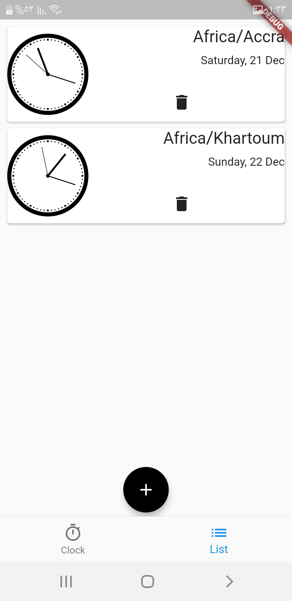
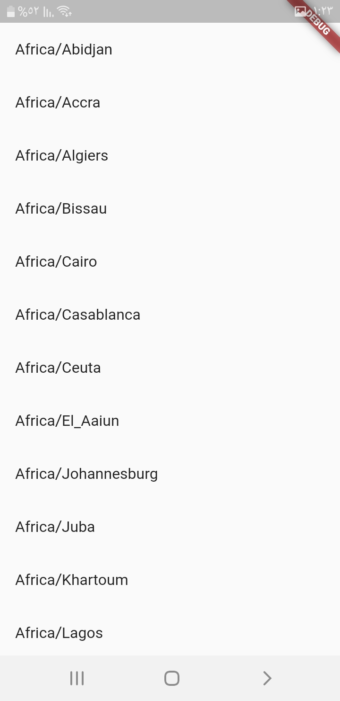

# world_clock_app

This flutter application is used to manage your time zones of preference. With this app, you can keep up with any time zone you want.

## Technologies
The app was created using:
* http (https://pub.dev/packages/http)
* flutter_spinkit (https://pub.dev/packages/flutter_spinkit)
* flutter_analog_clock (https://pub.dev/packages/flutter_analog_clock)
* intl (https://pub.dev/packages/intl)
* floor (https://pub.dev/packages/floor)

## Showcase and Screenshots

